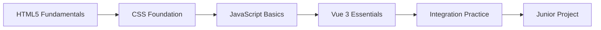
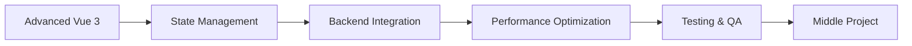
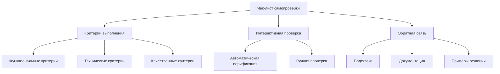
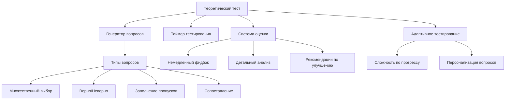
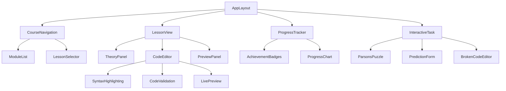
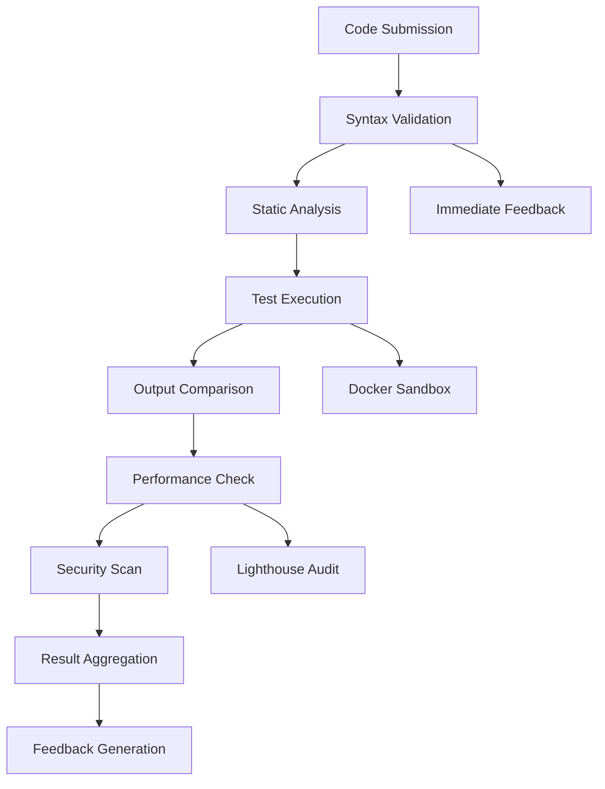

# Архитектура учебной платформы vuExpert

## Обзор системы

Архитектура учебной платформы vuExpert построена на основе философии проекта - "Реальный мир, а не песочница". Платформа представляет собой интерактивную обучающую систему, интегрированную с реальным кодом проекта и реализующую ключевые методологические принципы:

1. **От боли к лекарству** - студент сначала сталкивается с проблемами vanilla JS/SQL, затем изучает современные решения
2. **Fix-it-First** - основной формат заданий - исправление сломанного кода
3. **Docs-Driven** - обучение через работу с реальной документацией
4. **Спиральное обучение** - повторное прохождение фич через все слои стека

## Архитектурная схема

```mermaid
graph TB
    A[Пользователь] --> B[Frontend: Vue 3 + Vuetify]
    A --> CLI[CLI Tool: vuExpert]
    CLI --> C[Учебный API Gateway]
    B --> C
    C --> D[Backend: FastAPI]
    D --> E[(БД: PostgreSQL)]
    D --> F[(Redis: Кэш)]
    
    C --> G[Сервис уроков]
    C --> H[Сервис прогресса]
    C --> I[Сервис проверки кода]
    C --> T[Сервис тестирования знаний]
    C --> F[Сервис самопроверки]
    C --> P[Сервис интерактивных задач]
    
    I --> J[Docker Sandbox (Backend)]
    I --> W[Browser Sandbox (Frontend)]
    I --> K[AI Code Analysis]
    
    P --> PP[Parson's Problems]
    P --> PF[Prediction First]
    
    G --> L[Хранилище уроков]
    H --> M[Система достижений]
    H --> ST[Skill Tree]
    T --> U[База тестовых вопросов]
    F --> V[Чек-листы самопроверки]
    
    subgraph Уровни обучения
        N[HTML5 Foundation]
        O[CSS Architecture]
        P[JavaScript Core]
        Q[Vue 3 Essentials]
        R[Backend Integration]
        S[Production Ready]
    end
    
    L --> N
    L --> O
    L --> P
    L --> Q
    L --> R
    L --> S
```

## Уровни обучения

### Уровень 1: Junior (6-12 месяцев)



### Уровень 2: Middle (12-18 месяцев)



## Система интерактивных задач

### Типы задач

1. **Parson's Problems (Пазлы кода)**
   - Студент собирает работающий код из перемешанных блоков
   - Проверка логики без необходимости писать синтаксис с нуля
   - Идеально для изучения алгоритмов и структур данных

2. **Prediction First (Сначала предскажи)**
   - Студенту показывается код
   - Задача: предсказать вывод или поведение кода до его запуска
   - Формирует ментальную модель работы программы

3. **Broken Code (Отладка)**
   - Студент получает код с ошибкой
   - Задача: найти и исправить баг
   - Реализует принцип Fix-it-First

## Система интерактивных задач

### Типы задач

1. **Parson's Problems (Пазлы кода)**
   - Студент собирает работающий код из перемешанных блоков
   - Проверка логики без необходимости писать синтаксис с нуля
   - Идеально для изучения алгоритмов и структур данных

2. **Prediction First (Сначала предскажи)**
   - Студенту показывается код
   - Задача: предсказать вывод или поведение кода до его запуска
   - Формирует ментальную модель работы программы

3. **Broken Code (Отладка)**
   - Студент получает код с ошибкой
   - Задача: найти и исправить баг
   - Реализует принцип Fix-it-First

## Система самопроверки

### Архитектура чек-листов



### Компоненты самопроверки

1. **Функциональные критерии**
   - Проверка работы функциональности в браузере
   - Тестирование различных сценариев использования
   - Проверка граничных случаев

2. **Технические критерии**
   - Отсутствие ошибок в консоли
   - Соблюдение требований к коду
   - Соответствие ТЗ по файлам и структуре

3. **Качественные критерии**
   - Семантическая верстка
   - Доступность (a11y)
   - Производительность

## Система тестирования знаний

### Архитектура тестирования



### Типы вопросов и оценка

1. **Множественный выбор** (Multiple Choice)
   - 4 варианта ответа
   - Один или несколько правильных ответов
   - Оценка за частично правильные ответы

2. **Верно/Неверно** (True/False)
   - Бинарный выбор
   - Проверка понимания конкретных фактов

3. **Заполнение пропусков** (Fill in the blanks)
   - Пропуски в коде или тексте
   - Автоматическая проверка синтаксиса

4. **Сопоставление** (Matching)
   - Сопоставление терминов и определений
   - Проверка ассоциативного мышления

## Компонентная архитектура фронтенда

### Основные компоненты учебной платформы



## API архитектура

### Основные эндпоинты учебной платформы

```
GET    /api/courses              # Список курсов
GET    /api/courses/{id}         # Информация о курсе
GET    /api/lessons              # Список уроков
GET    /api/lessons/{id}         # Контент урока
POST   /api/lessons/{id}/submit  # Отправка решения
GET    /api/progress             # Прогресс пользователя
GET    /api/achievements         # Достижения
POST   /api/code/validate        # Валидация кода
```

## Модели данных

### Пользовательские модели
```sql
Users
- id
- username
- email
- current_level
- created_at

UserProgress
- user_id
- lesson_id
- status (completed/in_progress/pending)
- score
- submitted_at
- completed_at

Achievements
- user_id
- achievement_type
- unlocked_at
- metadata
```

### Модели контента
```sql
Courses
- id
- title
- description
- level (junior/middle)
- estimated_duration

Modules
- id
- course_id
- title
- order_index

Lessons
- id
- module_id
- title
- content (markdown/json)
- code_template
- validation_rules
- expected_output
```

## Система проверки кода

### Архитектура автоматической проверки



## Интеграция с существующим проектом

### Общая архитектура
```
vuExpert/
├── frontend/                 # Существующий Vue 3 проект
│   ├── src/
│   │   ├── components/
│   │   │    └── learning/     # Компоненты обучения
│   │   ├── views/
│   │   │    └── courses/      # Страницы курсов
│   │   ├── stores/
│   │   │    └── learning.ts   # Store для обучения
│   │   └── services/
│   │        └── learningApi.ts # API для обучения
├── backend/                  # Существующий FastAPI проект
│   ├── app/
│   │   ├── learning/         # Модуль обучения
│   │   │   ├── models.py
│   │   │   ├── schemas.py
│   │   │   ├── crud.py
│   │   │   └── endpoints.py
│   │   └── main.py          # Добавление роутов обучения
└── docker-compose.yml       # Добавление сервисов обучения
```

## Система прогресса и достижений

### Механика прогресса
- **Баллы за уроки**: Основные (10 баллов), продвинутые (20 баллов)
- **Бейджи**: За завершение модулей, быстрое прохождение, качество кода
- **Уровни опыта**: Разблокировка контента по достижению порогов

### Типы достижений
```yaml
achievements:
  html_master: Завершение HTML5 курса
  css_pro: Завершение CSS Architecture
  vue_expert: Завершение Vue 3 курса
  fast_coder: Завершение урока менее чем за 30 минут
  perfect_score: Идеальный результат в сложном уроке
  project_completion: Завершение итогового проекта
```

## Технические требования

### Фронтенд
- Vue 3 Composition API
- Vuetify 3 для UI компонентов
- Monaco Editor для редактирования кода
- WebSocket для live preview
- PWA для оффлайн-доступа

### Бэкенд
- FastAPI с async/await
- PostgreSQL для хранения прогресса
- Redis для кэширования и сессий
- Docker для изоляции кода
- JWT для аутентификации

### Инфраструктура
- Docker Compose для локальной разработки
- GitHub Actions для CI/CD
- Lighthouse для проверки качества
- Мониторинг производительности

## Безопасность

### Меры защиты
- Изоляция пользовательского кода в Docker sandbox
- Валидация и санация вводимых данных
- Rate limiting для API эндпоинтов
- Audit logging для действий пользователей
- Регулярные security audit

Эта архитектура обеспечивает масштабируемость, безопасность и высокую интерактивность учебной платформы, полностью соответствующей философии проекта vuExpert.