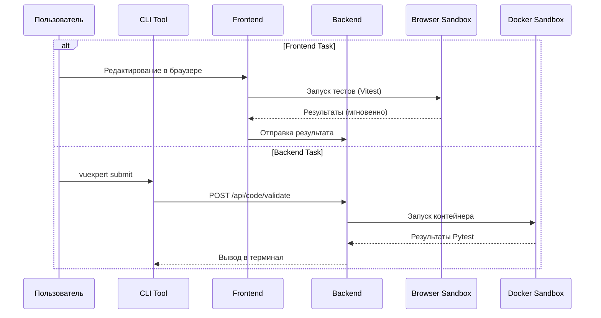
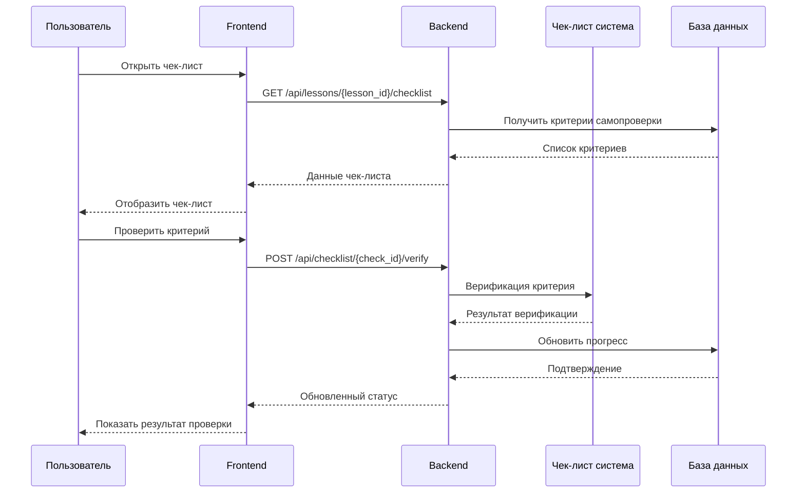
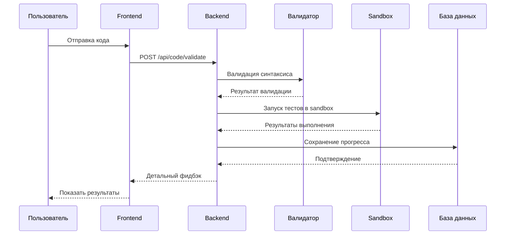

# Детали реализации учебной платформы vuExpert

## Система проверки заданий и прогресса

### Этапы проверки кода (Гибридный подход)



### Этапы самопроверки





### Типы проверок задания

1. **Синтаксическая проверка**
   - Валидация HTML/CSS/JavaScript/Vue
   - Проверка на использование запрещенных конструкций
   - Анализ структуры кода

2. **Функциональная проверка**
   - Запуск unit-тестов
   - Проверка ожидаемого вывода
   - Тестирование граничных случаев

3. **Качественная проверка**
   - Анализ соблюдения best practices
   - Проверка семантики HTML
   - Оценка доступности (a11y)
   - Анализ производительности

4. **Security проверка**
   - Проверка на XSS-уязвимости
   - Анализ безопасных практик
   - Валидация пользовательского ввода

## API спецификации

### Эндпоинты учебной платформы

```yaml
/api/courses:
  get:
    summary: Получить список курсов
    parameters:
      - name: level
        in: query
        schema:
          type: string
          enum: [junior, middle]
    responses:
      200:
        content:
          application/json:
            schema:
              type: array
              items:
                $ref: '#/components/schemas/Course'

/api/lessons/{lesson_id}/validate:
  post:
    summary: Отправить код на проверку
    requestBody:
      required: true
      content:
        application/json:
          schema:
            $ref: '#/components/schemas/CodeSubmission'
    responses:
      200:
        description: Результат проверки
        content:
          application/json:
            schema:
              $ref: '#/components/schemas/ValidationResult'
```

### Модели данных

```python
# Модели для прогресса
class UserProgress(Base):
    __tablename__ = "user_progress"
    
    id = Column(Integer, primary_key=True)
    user_id = Column(Integer, ForeignKey("users.id"))
    lesson_id = Column(Integer, ForeignKey("lessons.id"))
    status = Column(Enum("pending", "in_progress", "completed"))
    score = Column(Integer, default=0)
    submitted_code = Column(Text)
    feedback = Column(JSON)
    started_at = Column(DateTime)
    submitted_at = Column(DateTime)
    completed_at = Column(DateTime)

# Модели для уроков
class Lesson(Base):
    __tablename__ = "lessons"
    
    id = Column(Integer, primary_key=True)
    module_id = Column(Integer, ForeignKey("modules.id"))
    title = Column(String)
    description = Column(Text)
    content = Column(JSON)  # Markdown контент
    lesson_type = Column(Enum("theory", "coding", "parsons", "prediction", "quiz"))
    code_template = Column(Text)
    parsons_blocks = Column(JSON) # Для Parson's Problems
    prediction_options = Column(JSON) # Для Prediction First
    validation_rules = Column(JSON)
    expected_output = Column(Text)
    difficulty = Column(Enum("easy", "medium", "hard"))
    estimated_duration = Column(Integer)  # в минутах
    prerequisites = Column(JSON)  # ID уроков-предпосылок
```

## Интеграция с существующим кодом

### Модификация backend

```python
# backend/app/main.py - Добавление роутов обучения
from .learning import endpoints as learning_endpoints

app.include_router(
    learning_endpoints.router,
    prefix="/api/learning",
    tags=["learning"]
)

# backend/app/learning/endpoints.py
from fastapi import APIRouter, Depends
from . import crud, schemas

router = APIRouter()

@router.get("/courses")
async def get_courses():
    return await crud.get_courses()

@router.post("/lessons/{lesson_id}/validate")
async def validate_code(
    lesson_id: int,
    submission: schemas.CodeSubmission,
    db: AsyncSession = Depends(get_db)
):
    return await crud.validate_submission(db, lesson_id, submission)
```

### Модификация frontend

```typescript
// src/stores/learning.ts - Store для обучения
import { defineStore } from 'pinia'

export const useLearningStore = defineStore('learning', {
  state: () => ({
    currentCourse: null,
    currentLesson: null,
    progress: [],
    achievements: []
  }),
  
  actions: {
    async submitCode(code: string) {
      const response = await learningApi.validateCode(
        this.currentLesson.id, 
        code
      )
      this.updateProgress(response)
    }
  }
})

// src/services/learningApi.ts - API клиент
export const learningApi = {
  async validateCode(lessonId: number, code: string) {
    const response = await fetch(`/api/learning/lessons/${lessonId}/validate`, {
      method: 'POST',
      body: JSON.stringify({ code }),
      headers: { 'Content-Type': 'application/json' }
    })
    return await response.json()
  }
}
```

## Компоненты учебного интерфейса

### Структура компонентов

```
src/components/learning/
├── CourseNavigation.vue      # Навигация по курсам
├── LessonView.vue           # Основной вид урока
├── CodeEditor.vue           # Редактор кода с подсветкой
├── PreviewPanel.vue         # Live preview
├── ValidationFeedback.vue   # Отображение фидбэка
├── ProgressTracker.vue      # Трекер прогресса
└── AchievementBadge.vue     # Отображение достижений
```

### Компонент LessonView

```vue
<template>
  <v-container>
    <v-row>
      <v-col cols="12" md="6">
        <TheoryPanel :content="lesson.content" />
      </v-col>
      <v-col cols="12" md="6">
        <!-- Динамический выбор компонента задачи -->
        <component
          :is="taskComponent"
          :lesson="lesson"
          @submit="submitTask"
        />
        <ValidationFeedback :feedback="feedback" />
      </v-col>
    </v-row>
  </v-container>
</template>

<script setup>
import CodeEditor from './CodeEditor.vue'
import ParsonsPuzzle from './ParsonsPuzzle.vue'
import PredictionForm from './PredictionForm.vue'

const { lesson } = defineProps(['lesson'])

const taskComponent = computed(() => {
  switch (lesson.lesson_type) {
    case 'parsons': return ParsonsPuzzle
    case 'prediction': return PredictionForm
    default: return CodeEditor
  }
})
// ...
</script>
```

## Система автоматической проверки кода

### Docker Sandbox архитектура

```dockerfile
# sandbox/Dockerfile
FROM node:18-alpine

# Установка необходимых инструментов
RUN apk add --no-cache python3 make g++

# Создание безопасного окружения
RUN adduser -D sandboxuser
USER sandboxuser

WORKDIR /workspace

# Ограничения безопасности
COPY security-policy.json /etc/security-policy.json
```

### Процесс проверки

```python
# backend/app/learning/validation.py
import docker
import asyncio

class CodeValidator:
    def __init__(self):
        self.client = docker.from_env()
    
    async def validate_html(self, code: str, rules: dict) -> ValidationResult:
        # Проверка семантики HTML
        semantic_errors = await self.check_semantics(code)
        
        # Проверка доступности
        a11y_issues = await self.check_accessibility(code)
        
        # Проверка валидности
        validation_errors = await self.validate_with_w3c(code)
        
        return ValidationResult(
            semantic_errors=semantic_errors,
            a11y_issues=a11y_issues,
            validation_errors=validation_errors
        )
    
    async def run_in_sandbox(self, code: str, test_script: str):
        container = await self.client.containers.run(
            image='code-sandbox',
            command=['node', 'test-runner.js'],
            volumes={},
            network_mode='none',
            mem_limit='256m',
            nano_cpus=500000000,  # 0.5 CPU
            working_dir='/workspace'
        )
        # Обработка результатов
```

### Компонент TestView

```vue
<template>
  <v-container>
    <v-card>
      <v-card-title>{{ test.title }}</v-card-title>
      <v-card-subtitle>Время: {{ timeLeft }} минут</v-card-subtitle>
      
      <v-card-text>
        <QuestionRenderer
          v-for="(question, index) in questions"
          :key="question.id"
          :question="question"
          :index="index"
          @answer="updateAnswer"
        />
      </v-card-text>
      
      <v-card-actions>
        <v-btn @click="submitTest" :disabled="!canSubmit">
          Завершить тест
        </v-btn>
      </v-card-actions>
    </v-card>
  </v-container>
</template>

<script setup>
const { testId } = defineProps(['testId'])
const test = ref(null)
const questions = ref([])
const userAnswers = ref({})
const timeLeft = ref(0)

const loadTest = async () => {
  const response = await testApi.getTest(testId)
  test.value = response.test
  questions.value = response.questions
  timeLeft.value = test.value.time_limit
}

const submitTest = async () => {
  const result = await testApi.submitTest(testId, userAnswers.value)
  // Обработка результатов
}
</script>
```

## База данных для прогресса

### Схема базы данных

```sql
-- Таблица прогресса пользователей
CREATE TABLE user_progress (
    id SERIAL PRIMARY KEY,
    user_id INTEGER REFERENCES users(id),
    lesson_id INTEGER REFERENCES lessons(id),
    status progress_status DEFAULT 'pending',
    score INTEGER DEFAULT 0,
    submitted_code TEXT,
    feedback JSONB,
    attempts INTEGER DEFAULT 0,
    best_score INTEGER DEFAULT 0,
    time_spent INTEGER, -- в секундах
    created_at TIMESTAMP DEFAULT NOW(),
    updated_at TIMESTAMP DEFAULT NOW()
);

-- Индексы для производительности
CREATE INDEX idx_user_progress_user_id ON user_progress(user_id);
CREATE INDEX idx_user_progress_lesson_id ON user_progress(lesson_id);
CREATE INDEX idx_user_progress_status ON user_progress(status);
```

### Миграции базы данных

```python
# backend/app/learning/migrations.py
from alembic import op
import sqlalchemy as sa

def upgrade():
    op.create_table(
        'user_progress',
        sa.Column('id', sa.Integer(), nullable=False),
        sa.Column('user_id', sa.Integer(), nullable=False),
        # ... остальные колонки
    )
    
    op.create_foreign_key(
        'fk_user_progress_user_id',
        'user_progress', 'users', ['user_id'], ['id']
    )
```

## План развертывания

### Этапы реализации

1. **Фаза 1: Базовая инфраструктура** (2 недели)
   - Настройка базы данных для обучения
   - Создание API эндпоинтов
   - Базовая аутентификация

2. **Фаза 2: Система уроков** (3 недели)
   - Компоненты интерфейса уроков
   - Система навигации по курсам
   - Хранение контента уроков

3. **Фаза 3: Проверка кода** (4 недели)
   - Docker sandbox инфраструктура
   - Валидаторы для HTML/CSS/JavaScript
   - Система фидбэка

4. **Фаза 4: Прогресс и достижения** (2 недели)
   - Трекер прогресса
   - Система бейджей
   - Аналитика обучения

5. **Фаза 5: Оптимизация** (1 неделя)
   - Производительность
   - Безопасность
   - UX улучшения

### Технические зависимости

```json
{
  "dependencies": {
    "frontend": {
      "monaco-editor": "^0.44.0",
      "vue-monaco": "^1.2.2",
      "lighthouse": "^10.0.0"
    },
    "backend": {
      "docker": "^6.1.0",
      "html-validator": "^6.0.0",
      "esprima": "^4.0.1"
    }
  }
}
```

Эта детализация предоставляет четкий план для реализации каждого компонента учебной платформы с учетом интеграции в существующий проект vuExpert.